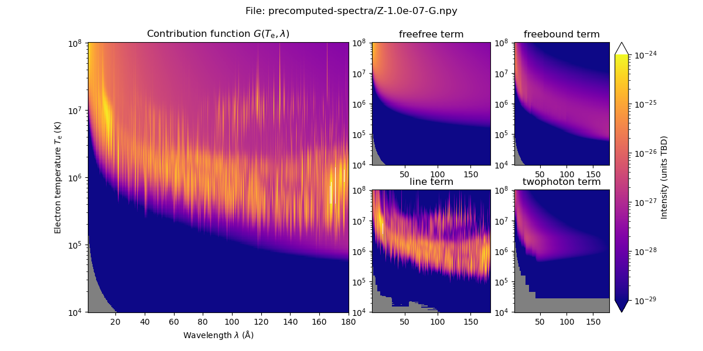

# Spectral contribution
Compute the spectral contribution function using ChiantiPy.

## Installation

```bash
# Clone the repository
git clone https://github.com/svaberg/spectral-contribution.git

# Navigate to the project directory
cd spectral-contribution
```
The program requires the `numpy` and `ChiantiPy` packages to be installed. I recommend installing `ChiantiPy` from the [GitHub source](https://github.com/chianti-atomic/ChiantiPy) and following the provided installation instructions. Note that the `ChiantiPy` package and its dependencies such as the CHIANTI database must be correctly installed.

## Usage
To create the required data run `compute-G-spectrum.py`.
```bash
python compute-G-spectrum.py 
```
This creates files with names like this `Z-1.0e-01-G.npy` 

To plot the results run `plot-G-spectrum.py` with the desired `.npy` file:
```bash
python plot-G-spectrum.py Z-1.0e-01-G.npy
```

Pre-computed spectral contribution functions are available in the `precomputed-spectra` folder
```bash
python plot-G-spectrum.py precomputed-spectra/Z-1.0e-07-G.npy
```

