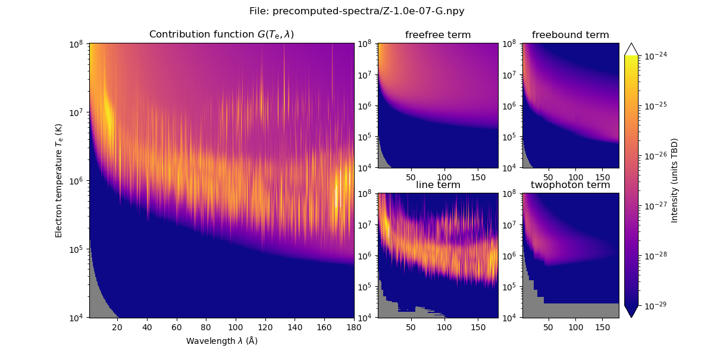

# Spectral contribution

Compute wavelength-resolved spectral contribution functions with
[ChiantiPy](https://github.com/chianti-atomic/ChiantiPy). The calculation saves
the free-free, free-bound, line, and two-photon components in a self-describing
NetCDF file.



## Installation

Clone the repository and create the supplied Conda environment:

```bash
git clone https://github.com/svaberg/spectral-contribution.git
cd spectral-contribution
conda env create -f environment.yml
conda activate spectral-contribution
```

ChiantiPy also requires a local installation of the CHIANTI atomic database.
Configure ChiantiPy so that it can find that database before running the
calculation.

## Compute a spectrum

Run the producer with its defaults:

```bash
python compute-G-spectrum.py
```

The default grid is linear in wavelength from 1 to 250 Angstrom with
`deltalambda = 0.05 Angstrom`. It uses 201 geometrically spaced temperatures
from `1e4` to `1e8 K`, an electron density of `1e10 cm-3`, the
`sun_photospheric_2015_scott` abundance table, and `minAbund = 1e-1`.

The resulting filename is:

```text
outputs/spectral-contribution.wavelength=1-250-dlambda=0.05.AbundanceName=sun_photospheric_2015_scott-min_abundance=1.0e-01.nc
```

For example, to include elements down to an abundance of `1e-4` relative to
hydrogen:

```bash
python compute-G-spectrum.py --min-abundance 1e-4
```

The default uses ChiantiPy's `spectrum` implementation. On a system where
multiprocessing is supported, request ChiantiPy's `mspectrum` implementation
with `--processes N`. For example:

```bash
python compute-G-spectrum.py --min-abundance 1e-7 --processes 16
```

The selected backend and requested process count are recorded in the NetCDF
metadata.

The wavelength limits, wavelength step, abundance table, threshold, and output
directory can all be changed on the command line. See the complete interface
with:

```bash
python compute-G-spectrum.py --help
```

`minAbund` is an elemental-abundance cutoff, not a numerical-accuracy
tolerance. ChiantiPy includes an element when its number abundance relative to
hydrogen is greater than or equal to the specified threshold.

## NetCDF contents

The NetCDF file has `density`, `temperature`, and `wavelength` coordinates and
contains the variables `freefree`, `freebound`, `line`, and `twophoton`. It also
embeds the H--Zn abundance values and records which elements pass the
`minAbund` cutoff.

Global metadata records the abundance source and reference, cutoff rule,
wavelength grid, Gaussian line-profile width, ionization-equilibrium and flux
settings, and the ChiantiPy and CHIANTI database versions.

## Plot a spectrum

Pass a generated NetCDF file to the plotter:

```bash
python plot-G-spectrum.py \
  outputs/spectral-contribution.wavelength=1-250-dlambda=0.05.AbundanceName=sun_photospheric_2015_scott-min_abundance=1.0e-04.nc
```

The plot is written beside the input file with `plot-components-` prepended to
the NetCDF stem and `.png` appended.

## Legacy precomputed data

The `.npy` arrays in `precomputed-spectra/` are products of the older workflow.
They remain available for reproducibility, but `compute-G-spectrum.py` now
writes NetCDF files to `outputs/`.
